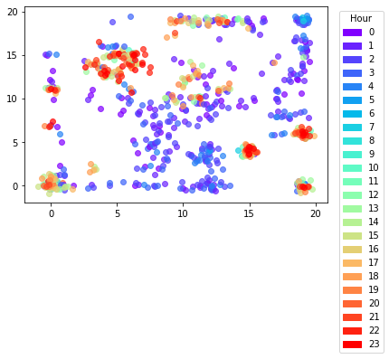
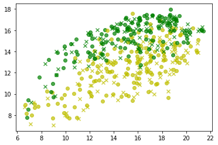
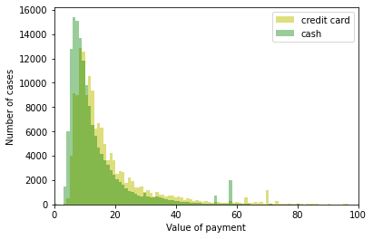

Final assignment for course Sistemas Inteligentes I, ULPGC Universidad de Las Palmas de Gran Canaria, January 2020.

//TODO:

confirm analyses in statistics

improve implementation

Algoritm description from:
Palomo, Esteban & Domínguez, Enrique. (2013). Hierarchical Color Quantization Based on Self-organization. Journal of Mathematical Imaging and Vision. 49. 1-19. 10.1007/s10851-013-0433-8.
https://www.researchgate.net/publication/236027587_Hierarchical_Color_Quantization_Based_on_Self-organization

Dataset: New York Yellow Taxi Trip Data (provided in the course)
https://data.cityofnewyork.us/Transportation/2018-Yellow-Taxi-Trip-Data/t29m-gskq

Implementation in TensorFlow using sessions. Works correctly for small sets, does not work on larger sets.

The analyses using self-organising maps were made with  MiniSOM library. When my implementation is improved, it will be possible to compare the behavior of both implementations.
https://github.com/JustGlowing/minisom

#### 1. Typical pickup spots for each hour
Pickup longitude and latitude were used in the training. Time data was only used to show additional dependency. Groups of dots indicate typical pickup spots, eg. airport.

#### 2. Price vs. payment type
The model was trained on ride distance, payment value and payment rate type (airport, group ride etc.). The markers indicate payment type (cash, credit card) and taxi company.

The outcome could show a discrepancy in payment value based on payment type for both companies.

<table>
  <tr>
    <td>

<b>Map</b>
      
x, o - taxi companies

&#x1F34F; - payment type 1 credit card

&#x1F49A; - payment type 2 cash

x, y axes scales are arbitrary, they are significant for the precision of the map but not for values of data
    </td>
  </tr>
  <tr>
    <td>

<b>Relation to data</b>
      

For credit card
- count: 185 157
- mean: 17.505

For cash
- count: 157 832
- mean: 13.478

The histogram is limited to 150 000 entries per payment type. The X axis was limited to 100 $.

Visibly, credit card payments are larger than cash payments.

    
  </tr>
</table>

