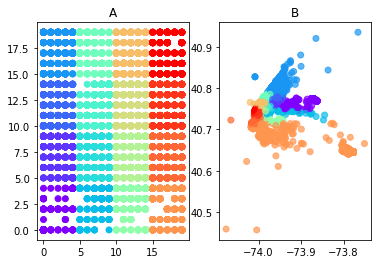

Final assignment for course Sistemas Inteligentes I, ULPGC Universidad de Las Palmas de Gran Canaria, January 2020.

//TODO: improve implementation

Algoritm description from:

Palomo, Esteban & Domínguez, Enrique. (2013). Hierarchical Color Quantization Based on Self-organization. Journal of Mathematical Imaging and Vision. 49. 1-19. 10.1007/s10851-013-0433-8.

https://www.researchgate.net/publication/236027587_Hierarchical_Color_Quantization_Based_on_Self-organization

Dataset: New York Yellow Taxi Trip Data (provided in the course)

https://data.cityofnewyork.us/Transportation/2018-Yellow-Taxi-Trip-Data/t29m-gskq

Implementation in TensorFlow using sessions. Works correctly for small sets, does not work on larger sets.

The analyses using self-organising maps were made with  MiniSOM library. When my implementation is improved, it will be possible to compare the behavior of both implementations.

https://github.com/JustGlowing/minisom

#### 1. Typical pickup spots for each hour
Pickup longitude and latitude were used in the training.

<table>
  <tr>
    <td>
      
**Self-organized map**
      

Data limited in number of observations. Each point represents 100 observations.

Groups of dots indicate typical pickup spots, whose latitude and longitude are physically close, eg. an airport.

The plot was additionally described with time data to show the traffic dynamics.

The map uses arbitrary axes that are significant for the precision of the map but are not relatable to physical location or distance.
    </td>
  </tr>  
  <tr>
    <td>
      
**Relation to data**
      

Data limited to one hour span (22:00-23:00). 
Not limited in number of observations.

**Map A** is a trained self-orgznized map that has beed divided into regions of different colors. Groups of locations were estimated as physically close in the training process. It is actually the same data as in the previous plot, but not reduced in number of observations and using colors in a different way.

**Map B** uses pickup latitude and longitude data for axes, so it shows real-life map of pickup spots in New York. The colors are the same as in Map A, so we can see that the locations that were estimated as close are indeed located within close area.
    </td>
  </tr>
</table>

#### 2. Price vs. payment type
The model was trained on ride distance, payment value and payment rate type (airport, group ride etc.). The markers indicate payment type (cash, credit card) and taxi company.

The outcome could show a discrepancy in payment value based on payment type for both companies.

<table>
  <tr>
    <td>

      
**Self-organized map**
      
x, o - taxi companies

&#x1F34F; - payment type 1 credit card

&#x1F49A; - payment type 2 cash

x, y axes scales are arbitrary, they are significant for the precision of the map but not for values of data
    </td>
  </tr>
  <tr>
    <td>

      
**Relation to data**
      

For credit card
- count: 185 157
- mean: 17.505

For cash
- count: 157 832
- mean: 13.478

The histogram is limited to 150 000 entries per payment type. The X axis was limited to 100 $.
    </td>
  </tr>
</table>

